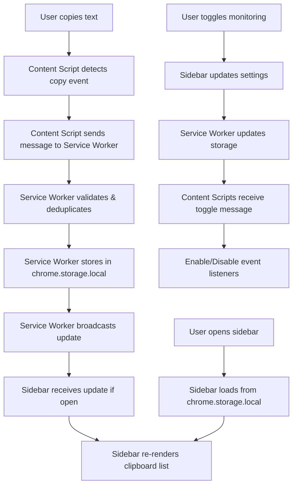

# Ctrl-See

A Chrome extension for clipboard history management that lives in the browser sidebar.

> [!NOTE]
> Coded to life with help from Claude 4.1 Opus

## Why

- No existing clipboard history extensions utilize Chrome's sidebar API
- Most clipboard managers have cluttered, outdated interfaces
- Wanted a clean, accessible solution that doesn't require popups or separate windows

## Features

- 📍 **Sidebar integration** - Always accessible, doesn't block content
- 💾 **Persistent storage** - Pin items to keep them across sessions
- 🔍 **Search** - Filter through clipboard history
- 🌓 **Dark/Light themes** - Automatic theme switching
- 📤 **Export** - Save clipboard history as JSON
- ✏️ **Edit entries** - Modify existing clipboard items
- 🎯 **Bulk operations** - Select multiple items for batch actions

## Architecture

### Data Flow

### Component Overview

| Component | Responsibility | Key Functions |
|-----------|---------------|---------------|
| **Content Script** | Monitors clipboard events on web pages | • Listens for copy/cut events • Captures selected text • Forwards to service worker |
| **Service Worker** | Central message broker and storage manager | • Message routing • Storage management • Deduplication • Settings synchronization |
| **Sidebar Panel** | User interface and interaction | • Display clipboard history • Search/filter • Edit/delete items • Export functionality |
| **Storage Layer** | Persistent data storage | • Clipboard history array • User settings • Pinned items |

## Technical Implementation

### Clipboard Interception
- **Content scripts** inject into all pages and listen for `copy` and `cut` events
- Falls back to `window.getSelection()` when Clipboard API is unavailable
- Sends captured text to service worker for processing

### Storage Strategy
- Uses `chrome.storage.local` for persistence
- Implements LRU cache with configurable max size (default: 1000 items)
- Pinned items bypass size limits
- Deduplication prevents consecutive duplicates

### Communication
- Service worker acts as central message broker
- Bi-directional messaging between content scripts and sidebar
- Real-time updates when clipboard changes occur

### Performance
- Debounced rendering in sidebar
- Virtual scrolling for large histories (planned)
- Minimal DOM manipulation through efficient diffing

## Installation

1. Clone the repository
2. Open Chrome and navigate to `chrome://extensions/`
3. Enable "Developer mode"
4. Click "Load unpacked" and select the extension directory

## Permissions

- `storage` - Persist clipboard history
- `clipboardRead/Write` - Access clipboard content
- `sidePanel` - Display in browser sidebar
- `activeTab` - Inject content scripts
- `<all_urls>` - Monitor clipboard on all sites

## Browser Compatibility

- Chrome 114+ (requires Side Panel API)
- Manifest V3

## License

MIT
